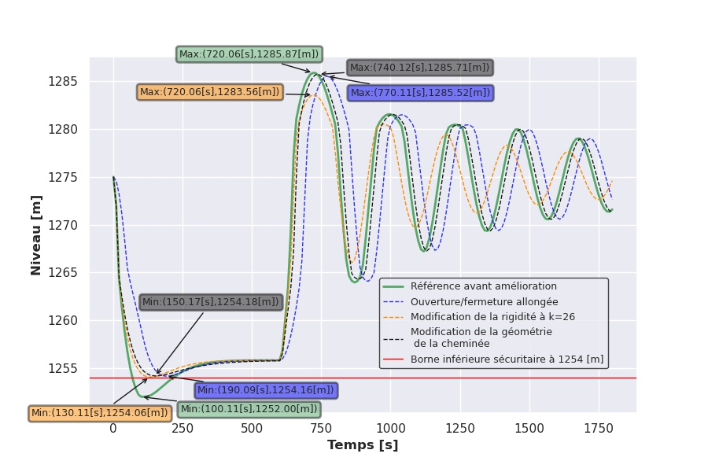

# Social network mobility a mirror of our mobility through time
## Abstract:
The paper focuses on three main aspects of human mobility: geographic movement, temporal dynamics, and the social network. We propose to extend the temporal dynamic treatment from just the day/weekly timescale in the paper to look at an entire year. We will enrich our dataset by adding time series data about holidays, events, and regional weather patterns. Our hypothesis is that mobility patterns are influenced by these features. We expect to see large changes for holidays and events which are planned moments for mobility while weather patterns as an unpredictable phenomenon are expected to have a different and milder influence on the movement pattern. This will allow us to understand broader temporal trends in human mobility and periodicity and the influence of environmental factors such as weather (seasons) or natural disasters. The findings of these questions could be incorporated into a more detailed and robust model of human mobility.
You can add a note
{:.note}salut
## Research Questions:
* Is there a significant difference in travel behavior between seasons (winter/summer/spring/fall)?

* Can we "visually" identify holidays/events/extreme weather and formulate a statistical test that distinguishes outliers?

* How does climate variation between locations influence movement patterns (places with cold/hot climates)?

## Proposed Datasets:
Dataset representing[ USA Cities latitude/longitude and states names](https://simplemaps.com/data/us-cities)

We will use this python package for [United States holidays.](https://pypi.org/project/holidays/)

# You can do math 
We can do math  $$ f(x) = x^2 $$.

$$
\begin{aligned}
  \phi(x,y) &= \phi \left(\sum_{i=1}^n x_ie_i, \sum_{j=1}^n y_je_j \right) \\[2em]
            &= \sum_{i=1}^n \sum_{j=1}^n x_i y_j \phi(e_i, e_j)            \\[2em]
            &= (x_1, \ldots, x_n)
               \left(\begin{array}{ccc}
                 \phi(e_1, e_1)  & \cdots & \phi(e_1, e_n) \\
                 \vdots          & \ddots & \vdots         \\
                 \phi(e_n, e_1)  & \cdots & \phi(e_n, e_n)
               \end{array}\right)
               \left(\begin{array}{c}
                 y_1    \\
                 \vdots \\
                 y_n
               \end{array}\right)
\end{aligned}
$$
## We can add image 
![Full-width image](data:image/jpeg;base64,/9j/4AAQSkZJRgABAQAAAQABAAD/2wCEAAkGBxISEhUSEhIVFRUVFRUVFRUVFRUVFRUVFRcXFhUYFRUYHSggGBolHRUVITEhJSkrLi4uFx8zODMtNygtLisBCgoKDg0NFxAQFy0eHR0tLS0tLS0tLS0wLS0vLS0vLS0tKy0rLS0tLSsuLS0tLS0tLy0tMi0tLSstLSstLS0tLf/AABEIALIBHAMBIgACEQEDEQH/xAAbAAACAwEBAQAAAAAAAAAAAAABAwACBAUGB//EAEAQAAIBAwEDCQYCCAUFAAAAAAABAgMREiEEMUEFEyJRYXGBkfAGMqGxwdFS4RUjQnKCkqLxFDNi0+IHF2Nzsv/EABgBAQEBAQEAAAAAAAAAAAAAAAABAgME/8QAKBEBAAICAQQABAcAAAAAAAAAAAERAhIhAzFBURMycZEEFCJhobHR/9oADAMBAAIRAxEAPwD6YiyKIsmdHJdBRS5ZMKsErcKYVdFkUTCmRV0ywtMtcIuglUwphVgplbkuBe5LlbhuBa4UUuG5FMuG4u4bgXuS5W4LgXJcpcNyC1yXK3BcC9wXK3JcC1wXK3Bcos2C5W4LgWuVBcDYtEbABsFwMCZZMUmWTNMGBKJhTCr3DcomFMimJlkxaYUwGJlrikw3IG3DcUpByCm3DcVclwG3DcVkHIim3JcVcNwGXDkKuTIBuRMheRMgG5EyFZEyAbkC4vImQDMiXF5AuAy5Li7kuBe4MimQLgXuByKXA2Be5W5VsFyowphRjVYPPG6c7bbhTMXPB54UuzdcKZiVYPPE1LbbhuYueDzwottuG5hVcPPClttuKhtF6kqat0YqV29976JW36CI1RfJc77ZKPF0X9CTHEl8w6WRLmBbQW58UuzdkHIwc8HnxRs3ZEyMPPh54UbN2RLmHnic+KNm/ImRh58nPko2bri61fHHS7lJRXezKq4jatotOkv/ACRfhdL6suqTlUOrkS5hVfh1aB58lLs23Bcx8+TnxRs2XBcx8+Tny0bNlwXMnPk58UbNVwXMvPge0doo2amwXMn+K6i3PjVNnEVQsqhmyDkatmmnnAqoZ1IOYsppVQKqGbMKmS1pp5wPOGbIKkLKacy8WZ4DE/Xr19JZTUpWMPJm022+D4NuHmrfMbkcKlVkq6npjC078b5ryVjWPNs5zVPSbXHGpKPVJ+V9BeZp9oVatdbpRjL6fQ5mRiJ4bmGrMOZlyCpFspqzJkZsiZCymnMKmZsiZiymnMmRmzLxkLKaYsx7Q8pSf4VZd61+Y11LGak+jrx18yxPlJi+G/aZdOXa7rx1XzKZiq0tIPrpw/pWD+MWLzJZTVkDIyyq24mefKUFpld9S1+RYsdHImZyJ8pPhHs6Ttrv3bxE9vqPW6XcrcLrV+HDiaiJZnKId1zEVNsiv2r9i1OLGpKbsrv5G7Z9kS1lq/gXiO6cz2aI7VKXuqy62NhDi3d/AomHIzsuh+YMxGRMha05qmWUzLzhZTIrSpByM2ZZTIttGQVIzqRdMgfFjYGdMvmFaMiOoZ8yZkDqlWyMVKHRfbFff6hrz6L7vnohs1bT11Go4hiYvKHa5Tlns+z1euGL70l9pHJUjp7J09gkuNKpfwb/AOTONmZ7Nx2g9SDmZ8w5iw/MmZnzDmFPUw5mbMLqWV3p28ANSkWUzmT2+PB37vzLwdaavGGMfxSdl/M7ItM217TV0eu/TzM8+UqaXvrzuY9ojBK9Sq6jX7NNafzS0XgmVryXu04KDW+VlOXnNNLwRuIimZnl1p1ZSpUnTi5f5ivuSSlkrvcvfMLrN2vUWrtamsnxv0vd4PcxLk40YxlOUrylU11fStFa/wANymzSisbSi7Jv3krtp9b62LiCIyyiKgZ042m7N42s5ybd2m926ystNS1SFlJXsrKPUtb3ujLU2zRpb8m31PRJfUraU27vRu9hsmsnVNoV3itby+VkxtHZXLWXku5L6ItQoJGuLMzksYwbSiktBmYjImRGz8wZicgZAPyBkJyBmBy1ItkZ1MOZWT8i0WITGKXr7/Yinxl6+33GRl69cO0zqXp/OXUuwOfjf+r8grTn69cCZ/l9+4zc5v8Ai+vsRMuvx7F1EGnP8vqyKfrsRnz+PwQHU4+C7gUfJ3cV1yXzHbVPpPu+tzNszvUj2P5a/Qm1T6b9cDU/KzHzvReyjzjtFH8cLrvs19UcHM6PsftGO0x/1Jx81dfIwctqNKtUi2labst8rN3Wi7GZmOWo7K5hzObLlCK3Rv1XdvgtfiNobPtFb3ItR4v3IJdr/Mus+S4a6lVR95pdj3+C3mWvtyTWOuut1by438CPZaEP82vk+MKKUvOp7vk2VfK0IaUaMIf6pfrJvz6PwNREMzLRRp7RNXjDGPGb6EV3yl9CsqVGLvUrOb/DTV13OpLTyuYK201KjvOTl1ZO9u5cARiuOotG9cpKOlKlGHa1nP8AmkreSQirVnN3nJt9rbFqQXMmy6zJFavi+lCeNveilJeV0/gav0lQm1epOCaSblRq23WbuovUwbZV0sLVRtJGZydYxxrmHY5T2uDk+bqKcdMbRkrRWiXSS4WOdG7SXUTG5opRMxM+Vz1v9MUNGibKaExYxSNWxTQmWzM+ZMyDRmTMz5kyA0ZEczPzhHMqHZkyEZgcyo5mZePpffqERl/f7dpbLv14cX3haaOc7fH6RLp27/hHtfWzKpO+j1W9/sxXZ2+kDnLLd0eHByYGzPTjb4yf2LZ+fF8IrqRi5931Tye5fhX0+gY1U9E+itW1xfrd5kVr5zj4RX1Jlw6tZfb6CqcZPpJdkb6JJcbvqKznCNoueUr6xh0vN7lYB7q8eL08PWgYtvcm1Favh5mKXKUVdxjFW3OTyl2aLRFaNOvtFoxjOd9EtVHTsX57jWkptB9LlSMJN21WSS35Nq11bhqYtr5aknK1NX11zu93CFvmzo1ORYU7f4raIUuHNLWo3+5HVd7SKbZyns+z6UNnym1dVK7ut7vanF/OXgb49Ofae6vszynVdeE5wqRinFpyilG907K27S56j232GjHaedq1XGNSEXhCLcpOPRbW6O5Le0eA/SO1V5rKvJpNtU0lGir77U4WV+3f2nqv+oFec3s8JuOUabbsre9iuL11iyZ94kxm7Yv03SpabPQinwnV/WS71H3V8TBtPKVat785SS3LdFfuxWi8EYoRivzGqfrQztDcYzPc2MOt+Q2LS3GdTLKRmcmowaVIOZldUo6pmcm4wbHWFSqmdSLRM21rQy1HU0LQyLCtMRkWZ4yLqRbYppUg5GdTDkUpozJmIUwZhKaMgZCcwZlQ/MmYjMGYso/MmQjMDmVKc+M3e1rvq4Lv9d5aM99n+9PXyXrUrHZJbnaEbdKU3Zvju3203FnUoLTKU7PSNNaN/vftPt4eRaFlJNdUVuXGT9PwHRhL3mktOjfRJLjZ7+xenie3SWtowW5KKvLTt1aXjqKp5zd1GU5PXX/6st3mb0ZnN0nKnG8XNzk9GoK/hk9O8zT22ztBQglvfvS77cH5G/ZfZqvg5VmqEGruc3GEEu92WqFz2/kzZdzntU1vUFjSvw/WTWq7ovfvEREfukzP0YqMalaV1GU+Cy3dmi07dWzqx9nJQjltdaFCL/E1Fvc3aC1l4J8Tjbb7dbRJY0cNnhrZUl07f+yV5eVjz09onUk5NylJ75Sbbfe2a5ZuPHL2b5Y2DZ9KNKW0S/FU6FPvt7z/AKTl8oe1+1VE45qlB/sUVzat1Np5S8WcKFLrfh/ctUpKzste8zeK1lMGU229d1/XE9XyzsyqUIVbbkm7dvRl/UjyWycobMmsnOL6N1O8ePSfVfq1sezo7RRq0+bobQop31nFS0as1fdw+Jn4sT5dMvw2eNTETLL7KbLzlaCtpkr9y1fyL+122c5tdTqi1Bfwqz+Nz1vshyJzT5yVSk0otJqSSbb39mh5f2k5Gp0nKUa6m3Nt7uKyk3q7atrtOfU6kY1br0Ohl1MpjGOfTiRkXyM+YM/WhjZrRp5wq5iMgoltUdmFFIjIgMiMQpMKkENuWixOQVIJR8ZlszPkWyKU0KYczPmTMts00ZkzM+ZMxZR+ZMxGZHMtpR6mBzEZkzFpR+YMhDmVdQqU5kJ5tYxlLqvxvwSXHTr+x2eT/Znaq6yaxpq97NRira2b3LtcnxM+1+3lCl0dh2SK4KpXeb8KUXjwWrbOb7T8o7TtFGhOvWlOM3ZxvanfhanG0U7xfA9PLz3EPR7ZQ2LY0ntE3Vk03CFOOUZW0TU01BR1XFnN2z2/nFOGyUadBfiaVSp4OSxj3KI/25oZ8ncnVo8Iyoy71Ff7Ujw8KPW34GImPLXN1DVt/KlWvLOrUnUl1zk5td13ouwXGnJ9neGNlu+RdSJOfpY6ftaFOK3697HKQlSGJmJydccYMuWRRBuYmW4xCpFNapGOlsUL3tbtTafmjVOQpSMTLrjccw0UKk46KpNrtk38Rybe9t+JlTHxkctcbuno/M9XXXaa+p6qByEoZE285sWXQpMvFgNTLqQjIvcqHKRMxKkTIB+RHMTkRSAfkFTEZEUioepkyE5gyAe5kzEZkcio0Zgy9bxDmDMDRmDIQ5kcyobmVnMVl6/IDl2lR4uEG9bqx7OtTU+TVLfzVRPwcl/uHA9nOQJbVUxhU5tLfJ662vZLr7D6PydyKqdKpSqxcoSte2t1u4Wa3RO3xLmocMujOMRllxf9e/4Y9pfO8hS4uhtEZdyk7fKqzwCkfUeSNii9m5Q2eHuTjele7s0pWXXo1FeB4flb2X2jZ451IpR01Uk/edtE9Xq15nPPKIymHTpYTljcOREYhSRdS9aGZluINTLpiEw5ekYmW4g/IjmIUw3M21S7kVuQMSKZAdFiYjEwHJl0xKZZMocpFlIRkWyCHZByEZFsgG5EyFKX9mRyCHZBy6xGRFIB+ZHIRmTIoe5AzEuXpBzAbkTISpgzKh+QM/mJbJKQQ5zA5CXMDlxKh2YMhLmVlJ+mUebhKSd4ylF9cZNXXbbedr2f9p62y1MnerH8MpNb+zj+RxbgbJlES30urnhxE8evH2fQ/wDuUtXDZUpSVm3J6rfra3Ued5Z9oa21tOq0lHSMI6RS4Hn0xykc9Lm55d/jzGM44Yxjfev9m5+x+YVITkS5q3no7LsZZMUmWRGjFIuKLpgMTLJi0yykRTYlosTcupAOUg3E5lkwGphTFJhAapBT19WE3C5BDVIikLUgNgNTJn9BTkHIoZkRsXnbeBvq+IDciSkKbv8AEGehUOy9cAZi8uIFLyAZftJmKlIknwKhmT/uBS108ikpaevArfx+4QxyBn69IXJ3+hMnw170io4ICEBAx9eQxEIZltaO8u9xCAMgFPVBIFWe4K3EIBe/yDHcQhFSO/wRdkIQFbvH6hf1IQqrRYb6+ZCERF9PqFPQhCgQfrzLgIBWL9fxFuJCABcQRCQqICPEhASiehI7n3v5EIEUv0vD7F3ufgEgQqT3d7+hd/f5EIUL4vuRXJ9ZCFZf/9k=){:.lead data-width="800" data-height="100"}

## We can add plot 

| {:width="960" height="540"} | 
|:--:| 
| *Fig1: Solution pour multiturbine* |
## We can add Gif 

## Getting started
* [Install]{:.heading.flip-title} --- How to install and run Hydejack.
* [Upgrade]{:.heading.flip-title} --- You can skip this if you haven't used Hydejack before.
* [Config]{:.heading.flip-title} --- Once Jekyll is running you can start editing your config file.
{:.related-posts.faded}

## Using Hydejack
* [Basics]{:.heading.flip-title} --- How to add different types of content.
* [Writing]{:.heading.flip-title} --- Producing markdown content for Hydejack.
* [Scripts]{:.heading.flip-title} --- How to include 3rd party scripts on your site.
* [Build]{:.heading.flip-title} --- How to build the static files for deployment.
* [Advanced]{:.heading.flip-title} --- Guides for more advanced tasks.
{:.related-posts.faded}

## Other
* [LICENSE]{:.heading.flip-title} --- The license of this project.
* [NOTICE]{:.heading.flip-title} --- Parts of this program are provided under separate licenses.
* [CHANGELOG]{:.heading.flip-title} --- Version history of Hydejack.
{:.related-posts.faded}

[install]: install.md
[upgrade]: upgrade.md
[config]: config.md
[basics]: basics.md
[writing]: writing.md
[scripts]: scripts.md
[build]: build.md
[advanced]: advanced.md
[LICENSE]: ../LICENSE.md
[NOTICE]: ../NOTICE.md
[CHANGELOG]: ../CHANGELOG.md
